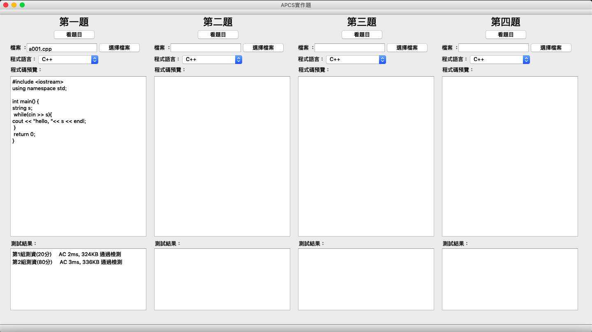
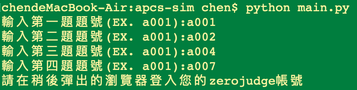
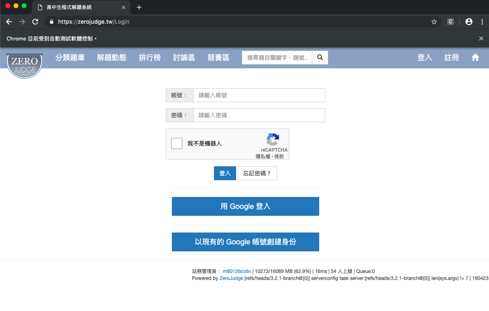
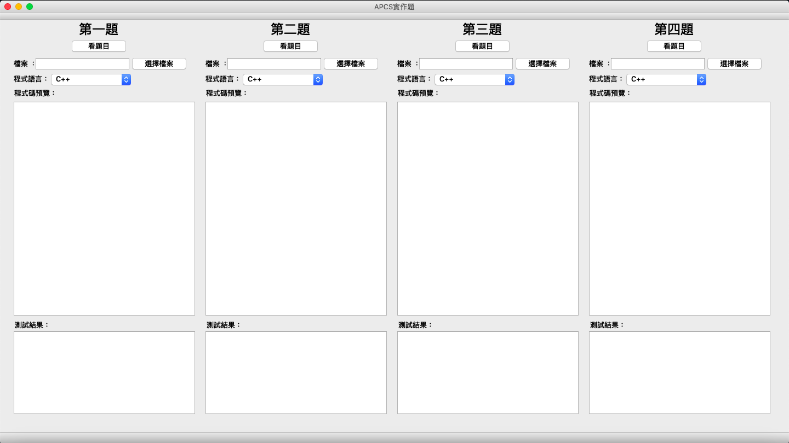

# apcs-sim
APCS實作題模擬器
[](https://github.com/chenliTW/apcs-sim/issues)  [](https://github.com/chenliTW/apcs-sim/)
[](https://apcs.csie.ntnu.edu.tw/)
<br>
專案宗旨：做一個APCS實作題的視窗，可以在Zerojudge上選題，然後把judge後的結果印在視窗上<br>
run with python3<br>
目前只支援 Submit C++<br>
<hr>
下載執行檔(Realease):<br>
For Windows : https://github.com/chenliTW/apcs-sim/releases/tag/v0.8.0
<hr>

<hr>

```
pip3 install pipenv
python3 main.py
```
<h4>輸入要模擬的題目，等等會有登入的form跳出來</h4>
<br>

<br>
<h4>使用各種方法登入Zerojudge</h4>
<br>

<br>
<h4>擁有連接Zerojudge題庫的APCS實作題環境</h4>

